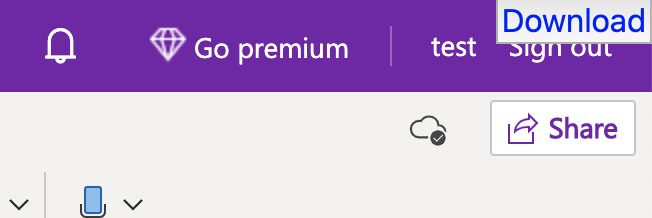

# export-onenote-to-html

A Toolkit to convert OneNote pages into HTML and Markdown with images.

## Usage

Need to do two steps.

### 1. Donwload OneNote page

1. Install [onenote-downloader.user.js](onenote-downloader.user.js) using [Greasemonkey](https://addons.mozilla.org/ja/firefox/addon/greasemonkey/) or [Tampermonkey](https://chrome.google.com/webstore/detail/tampermonkey/dhdgffkkebhmkfjojejmpbldmpobfkfo?hl=ja) extentsion.
2. Open OneNote Web: <https://www.onenote.com/>
3. Open page you want to download
4. Wait for fetching images
5. Click "Download" button on top-right



Tips: when browser complete downloaded, make button `blue` color.

### 2. Convert downloaded page to HTML and Markdown

Convert downloaded html file and convet it to HTML and Markdown.
Also, decode base64 image and output it as actual image file.

```
$ npx export-onenote-to-html downloaded-page.html --output out/ 
# out/index.html
# out/README.md
# out/1.png ...
```

## Changelog

See [Releases page](https://github.com/azu/export-onenote-to-html/releases).

## Running tests

Install devDependencies and Run `npm test`:

    npm test

## Contributing

Pull requests and stars are always welcome.

For bugs and feature requests, [please create an issue](https://github.com/azu/export-onenote-to-html/issues).

1. Fork it!
2. Create your feature branch: `git checkout -b my-new-feature`
3. Commit your changes: `git commit -am 'Add some feature'`
4. Push to the branch: `git push origin my-new-feature`
5. Submit a pull request :D

## Author

- [github/azu](https://github.com/azu)
- [twitter/azu_re](https://twitter.com/azu_re)

## License

MIT © azu
